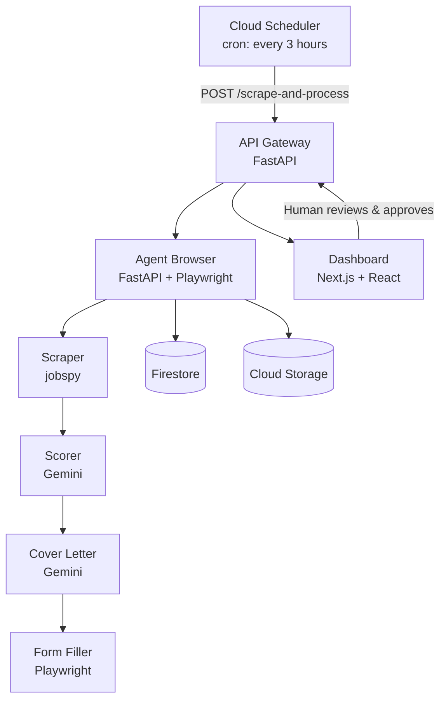
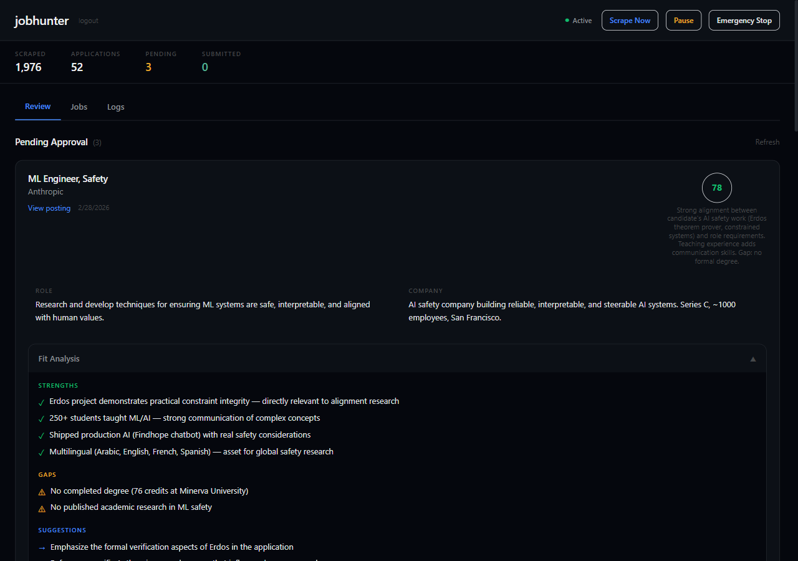
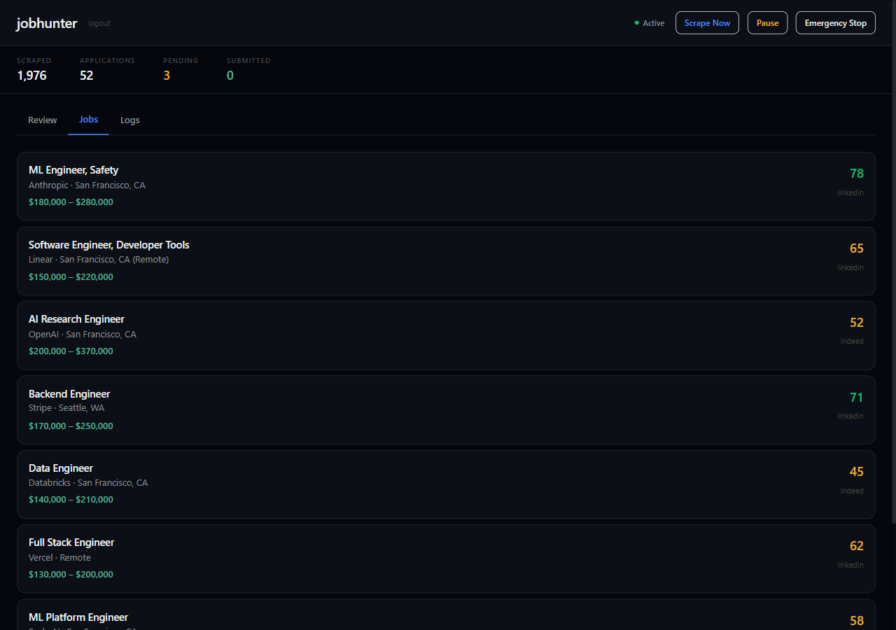
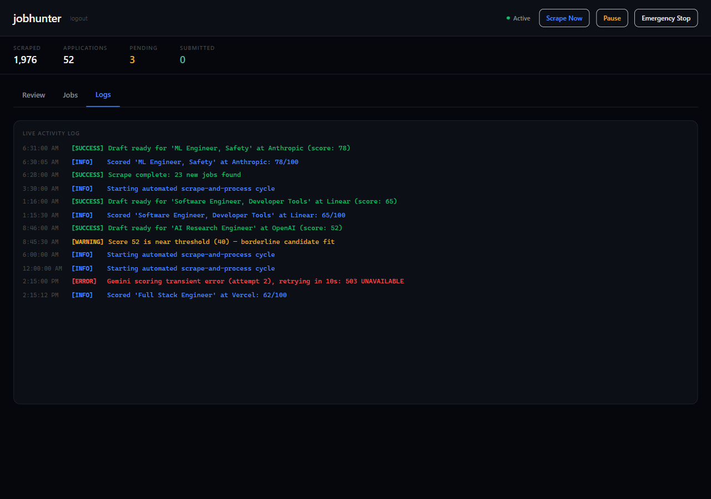

# jobhunter

An AI job application system that scrapes, scores, and drafts — but won't submit without your say-so, and won't lie about your credentials.


-lightgrey.svg)

> **Status:** Currently offline (GCP billing paused). All metrics below reflect the last active state. Everything runs locally via `docker compose up`.

## Why

I needed a job. I also needed to not manually apply to 200 listings a week.

So I built a system where AI agents scrape job boards, score each opportunity against my actual background, generate cover letters, and pre-fill application forms. The system runs every 3 hours on Cloud Run. It's found 1,976 jobs, scored 247 of them, and drafted 52 applications.

It has submitted zero.

Not because the automation is broken — the `/apply` endpoint exists, the Playwright form filler works, the ATS detection handles Greenhouse, Lever, and Workday. The system *can* submit. It doesn't, because the architecture requires a human to review every application and click "Approve" before anything goes out.

The more interesting constraint is honesty. The system prompts contain an explicit rule: "The candidate does NOT have a completed degree. Do NOT say 'Bachelor's degree.'" The AI could write more impressive cover letters by fabricating credentials. It's told not to. This is a real tension — the optimizer wants to maximize callbacks, the constraint says be truthful.

Half the scored jobs cluster at exactly 50 on the 0-100 scale. The scoring threshold is 40. Which means the model's uncertainty generates work for the human reviewer. The AI hedges, and I have to decide.

This is a small-scale version of the alignment problem: an autonomous agent optimizing for an objective while constrained by values, with a human in the loop who has the final say. Same tension I explored in [polymarket_bot](https://github.com/Cuuper22/polymarket_bot) — knowing when an autonomous system should NOT act. It also found me some good leads.

## Architecture



Three services on Cloud Run. Firestore is the shared state. The dashboard polls every 30 seconds and shows pending applications for human review.

## Dashboard

The review interface where every application gets a human decision before submission.

| Review Queue | Jobs List | Activity Log |
|:---:|:---:|:---:|
|  |  |  |

Each application card shows the AI's fit analysis (score, strengths, gaps, suggestions), the generated cover letter, pre-filled form fields, and an outreach email drafter. The reviewer can edit anything before approving.

## The Safety Mechanisms

This is the part I care about most.

**Human-in-the-loop approval.** Every application goes through a review queue. The dashboard shows the job, the generated cover letter, and pre-filled form fields. Nothing submits until a human clicks "Approve." The `/apply` endpoint checks `application.status == APPROVED` and rejects anything else with a 400.

**Honesty constraints in system prompts.** Three separate AI modules (scorer, cover letter, form QA) each contain explicit instructions about what the system must not fabricate:

```python
# From cover_letter.py
"The candidate does NOT have a completed degree. He has 76 credits
from Minerva University. Do NOT say 'Bachelor's degree' — say
'coursework in AI and Physics at Minerva University' or similar
honest framing."

# From job_scorer.py
"No completed degree (76 credits) — penalize roles requiring
BS/MS but not fatally"

# From form_qa.py
"For yes/no questions about degree: the candidate does NOT have
a completed degree"
```

This isn't post-hoc filtering. The constraints live in the system prompts themselves — specification-level truthfulness enforcement. Same principle as [Erdos](https://github.com/Cuuper22/Erdos): prevent the optimizer from redefining its own constraints. There, SHA-256 locks. Here, system prompt constraints.

**Emergency controls.** Three endpoints on the API gateway:
- `POST /pause` — pause the Cloud Tasks queue
- `POST /resume` — resume the queue
- `POST /emergency-stop` — pause AND purge all pending tasks

## How It Works

### Scoring

Gemini 3.1 Pro scores each job 0-100 using a structured rubric:

| Score Range | Meaning |
|-------------|---------|
| 80-100 | Strong fit — skills and experience align well |
| 60-79 | Good fit — most requirements met |
| 40-59 | Moderate fit — some gaps but worth considering |
| 20-39 | Weak fit — significant mismatches |
| 0-19 | Poor fit — wrong domain or level |

The model returns structured JSON: `score`, `reasoning`, `role_summary`, `company_summary`, `strengths`, `gaps`, and `suggestions`. The scoring threshold is 40. In practice, scores cluster heavily around 50 — the model hedges when it's unsure, which creates a fat middle band of "maybe" jobs that require human judgment.

### Cover Letters

Each cover letter follows a rigid 4-paragraph structure:

1. **Hook** (3-4 sentences) — why this company, why this role
2. **Fit & Experience** (5-7 sentences) — relevant background
3. **Projects & Technical Depth** (4-6 sentences) — specific work
4. **Close & Call to Action** (2-3 sentences) — next steps

Word count is enforced at 250-350 words. If the first generation is too short, the system retries with explicit length correction. Tone adapts to company culture — startup casual vs. corporate formal. The honesty constraint means every cover letter says "coursework at Minerva University" instead of "degree from Minerva University."

### Outreach Emails

A separate module generates warm networking emails — not cold spam. Each email is 150-200 words, references something specific about the recipient or company, and makes a low-friction ask (15-minute chat, not "give me a job"). Same honesty constraints apply: only reference real experience, never fabricate.

Available via `POST /generate-outreach` with an optional contact name.

## ATS Form Detection

`form_filler.py` detects five applicant tracking systems by URL pattern and handles each accordingly:

| ATS | Detection | Handling |
|-----|-----------|---------|
| Greenhouse | `greenhouse.io` in URL | Dedicated adapter — `#first_name`, `#last_name`, `#email`, cover letter textarea, file upload |
| Lever | `lever.co` in URL | Dedicated adapter — `input[name='name']`, `input[name='email']`, comments field |
| Workday | `myworkdayjobs.com` in URL | Dedicated adapter — `data-automation-id` attributes for each field |
| iCIMS | `icims.com` in URL | Detected, screenshot for manual review |
| BambooHR | `bamboohr.com` in URL | Detected, screenshot for manual review |

All form filling stops before submission. The submit button is never clicked automatically. Screening questions found on the form are detected and answered by the form QA module.

## Tech Stack

| Component | Technology |
|-----------|-----------|
| **Agent Browser** | Python, FastAPI, Playwright, python-jobspy |
| **AI Engine** | Google Gemini 3.1 Pro Preview |
| **API Gateway** | Python, FastAPI |
| **Dashboard** | Next.js 14, React 18, TypeScript, Tailwind CSS |
| **Database** | Google Cloud Firestore |
| **File Storage** | Google Cloud Storage |
| **Deployment** | Google Cloud Run (3 services) |
| **Scheduling** | Google Cloud Scheduler (cron: `0 */3 * * *`) |
| **Secrets** | Google Secret Manager |
| **Auth** | Bearer token (API gateway), Cloud IAM (service-to-service) |

## Running Locally

```bash
git clone https://github.com/Cuuper22/jobhunter.git
cd jobhunter
cp .env.example .env
# Edit .env with your Gemini API key and applicant details
docker compose up
```

This starts:
- Firestore emulator on port 8181
- Agent Browser on port 8080
- API Gateway on port 8081
- Dashboard on port 3000

You'll need a Gemini API key. The `context/` directory (mounted read-only into agent-browser) should contain your resume PDF and any background context files — see `.env.example` for the full list of configuration options.

## Testing

There are no unit tests in this repository. The safety mechanisms are architectural: honesty constraints live in system prompts, the approval workflow requires human confirmation, and emergency controls can halt the pipeline. This is a deliberate trade-off — faster iteration on constraint design at the cost of test coverage.

## Known Issues

**Score clustering.** ~50% of scored jobs land at exactly 50. The Gemini model defaults to the midpoint when uncertain, which makes the 40-point threshold less useful than intended. A calibration pass would help, but I haven't done it.

**Duplicate scraping.** jobspy occasionally returns the same listing under different IDs. The dedup logic catches URL-level duplicates but misses same-job-different-URL cases.

**iCIMS and BambooHR adapters are thin.** Detection works, but these two ATS platforms fall back to screenshots for manual review. Their non-standard field naming would need dedicated adapter functions.

**Cover letter quality variance.** Some generated letters are genuinely good. Others are formulaic. The 4-paragraph constraint helps consistency but can make letters feel templated. A future version would benefit from few-shot examples per company type.

## License

MIT
